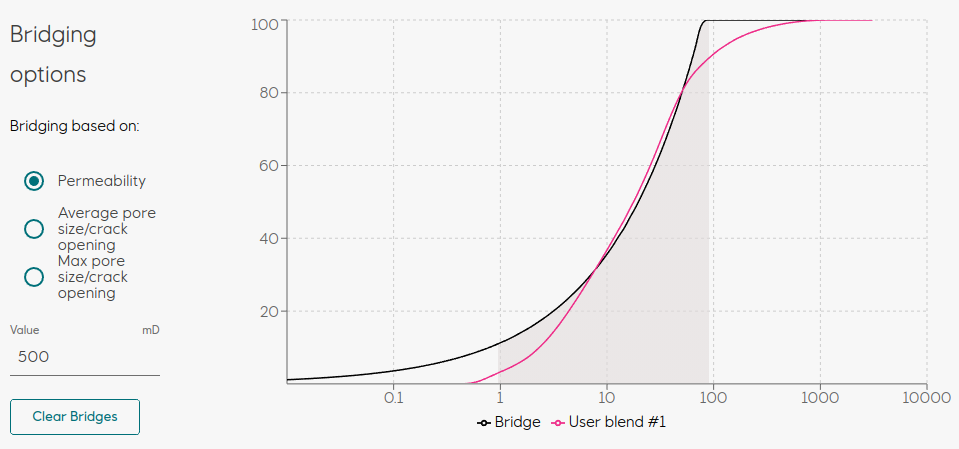

# Lost Circulation Material Optimizer
[![License][license-badge]][license]

Web application for creating, comparing, and optimize blending of lost circulation material used to bridge fractures and stop losses in rock formations during petroleum drilling.

This repository is the result from the merger of the two summer intern projects from 2020.

- Team Blend <https://github.com/equinor/LCMLibrary-Blend>
- Team Bridge <https://github.com/equinor/LCMLibrary-Bridge>

## Contributing

Pull requests are welcome. For major changes, please open an issue first to discuss what you would like to change.

Please make sure to update tests as appropriate.

## Development

See the [docs](https://varia.equinor.com/docs/default/system/lcm) if you want to start developing.

[license-badge]: https://img.shields.io/badge/License-MIT-yellow.svg
[license]: https://github.com/equinor/lcm/blob/master/LICENSE.md
