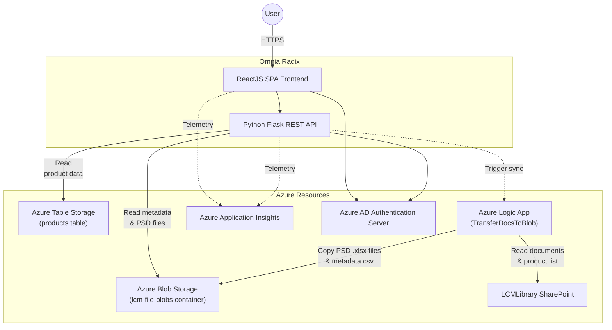

# Architecture

This document describes the system architecture of the LCM Optimizer. It provides an overview of the main components, their interactions, and the underlying technologies used in the application.

## System overview

## Component details

### Omnia Radix (PaaS)

The application runs on [Omnia Radix](https://www.radix.equinor.com), Equinor's PaaS platform. Configuration is defined in [radixconfig.yaml](../../../radixconfig.yaml).

| Component | Technology | Role |
|-----------|------------|------|
| **Web** | React, TypeScript, Vite | Single Page Application. Authenticates users via OAuth2 PKCE flow against Azure AD. |
| **API** | Python, Flask, Gunicorn | REST API handling calculations (bridging, optimization), data access, and PDF report generation.|

### Azure Resources

| Resource | Role |
|----------|------|
| **Azure Table Storage** | Stores processed product Particle Size Distribution (PSD) data in a `products` table. Rebuilt on each SharePoint sync. |
| **Azure Blob Storage** | Stores raw data in the `lcm-file-blobs` container: `metadata.csv` (product metadata) and individual `.xlsx` files (PSD curves per product). |
| **Azure Logic App** | Bridges SharePoint and Azure Storage. Copies PSD documents and translates the SharePoint product list into `metadata.csv`. Triggered by the API on user request. |
| **Application Insights** | Collects telemetry from both frontend (custom events) and backend (request logs) via OpenTelemetry. |
| **LCMLibrary SharePoint** | Primary data source. Product metadata and PSD Excel files are maintained here by domain users. |
| **Azure AD** | Authentication provider for both frontend and backend. Users must have appropriate roles to access the application. |

> For information about authentication flow and access management, see the [Authentication](authentication.md) runbook chapter.
