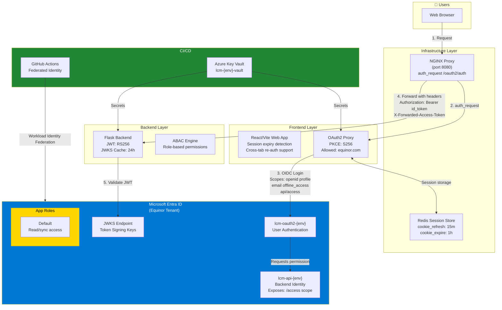
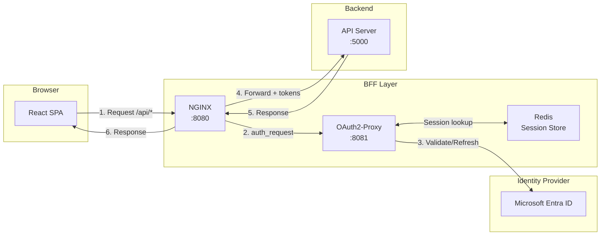
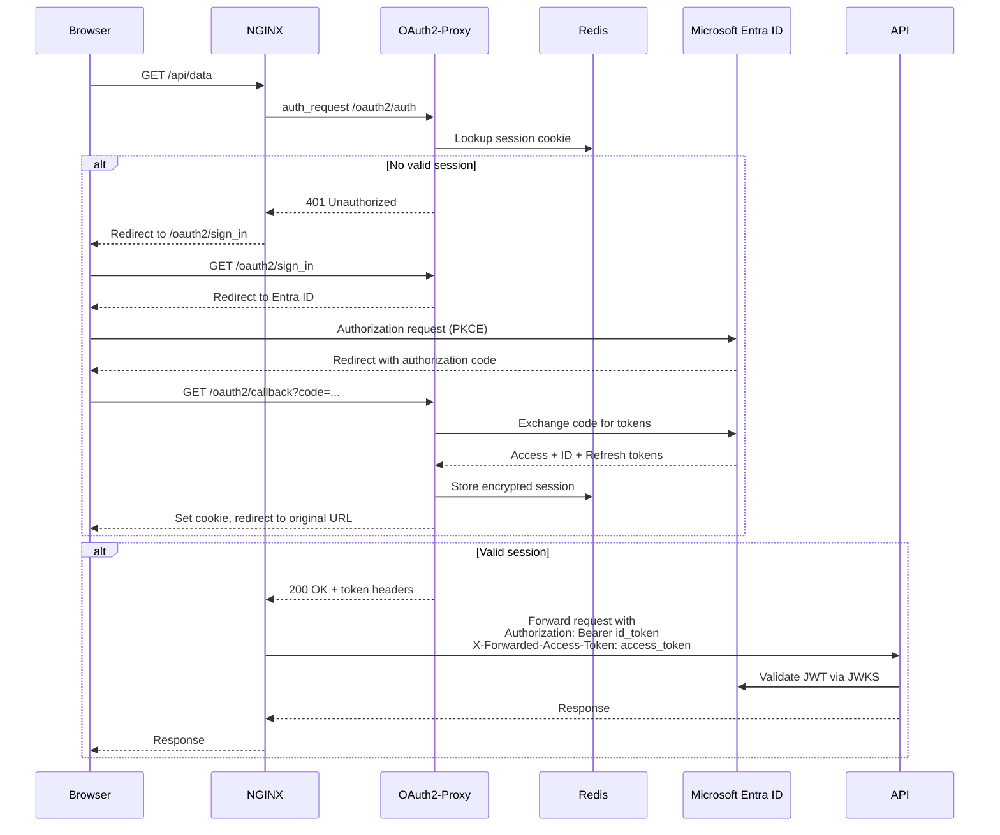

# Authentication

This document describes the authentication and authorization flow used by the LCM Optimizer.

## Auth Architecture Overview

## BFF Authentication Pattern

The BFF (Backend-for-Frontend) pattern places a server-side component between the browser and backend API to handle authentication. In this implementation:

- **OAuth2-Proxy** manages authentication sessions and token handling
- **NGINX** acts as the entry point, enforcing auth via `auth_request`
- **Redis** stores encrypted session data
- **Frontend** uses cookie-based sessions (no tokens in JavaScript)

### Authentication Flow

The following sequence diagram shows the step-by-step authentication flow when a user accesses the application:

## Security Benefits

| Feature                     | Implementation                         | Benefit                                  |
|-----------------------------|----------------------------------------|------------------------------------------|
| **No tokens in browser JS** | OAuth2-Proxy stores tokens server-side | Prevents XSS token theft                 |
| **HttpOnly cookies**        | `cookie_httponly = true`               | JavaScript cannot access session cookie  |
| **Secure cookies**          | `cookie_secure = true`                 | Cookies only sent over HTTPS             |
| **SameSite cookies**        | `cookie_samesite = "lax"`              | CSRF protection                          |
| **Encrypted sessions**      | `OAUTH2_PROXY_COOKIE_SECRET`           | Session data encrypted at rest in Redis  |
| **Automatic token refresh** | `cookie_refresh = "15m"`               | Tokens refreshed before expiry           |
| **PKCE**                    | `code_challenge_method: S256`          | Prevents authorization code interception |
| **API 401 responses**       | `api_routes = ["^/api/.*"]`            | APIs return 401, not redirect            |
| **JWT validation**          | RS256 + JWKS                           | Cryptographic token verification         |
| **24h JWKS cache**          | `TTLCache(ttl=86400)`                  | Performance with security                |

## Azure AD App Registration

The application has a single App Registration in Azure AD:

| Property | Value |
|----------|-------|
| **App ID (Client ID)** | `1dbc1e96-268d-41ad-894a-92a9fb85f954` |
| **Tenant ID** | `3aa4a235-b6e2-48d5-9195-7fcf05b459b0` |
| **API Identifier URI** | `api://lost-circulation-material-api` |

### App Registration links

- [App Registration in Azure Portal](https://portal.azure.com/#view/Microsoft_AAD_RegisteredApps/ApplicationMenuBlade/~/Overview/appId/1dbc1e96-268d-41ad-894a-92a9fb85f954/isMSAApp~/false)
- [Enterprise Application](https://portal.azure.com/#view/Microsoft_AAD_IAM/ManagedAppMenuBlade/~/Overview/objectId/e8f33fc2-ed9d-42ba-a8e1-44951d111671/appId/1dbc1e96-268d-41ad-894a-92a9fb85f954)

### Managing user access

To manage who can access the application, you need to be added as an owner to the [Enterprise Application](https://portal.azure.com/#view/Microsoft_AAD_IAM/ManagedAppMenuBlade/~/Overview/objectId/e8f33fc2-ed9d-42ba-a8e1-44951d111671/appId/1dbc1e96-268d-41ad-894a-92a9fb85f954).

## Permissions required

| Action | Requirement |
|--------|-------------|
| Managing user access | Owner of the Enterprise Application |
| Managing App Registration | Owner of the Azure App Registration |
| Managing Radix | Member of the `Radix Platform Users` groups (via AccessIT) + member of the [Team Hermes Radix Admin](https://portal.azure.com/#view/Microsoft_AAD_IAM/GroupDetailsMenuBlade/~/Overview/groupId/13b319d8-ee25-4b6b-97db-74bad07d2057) group |
